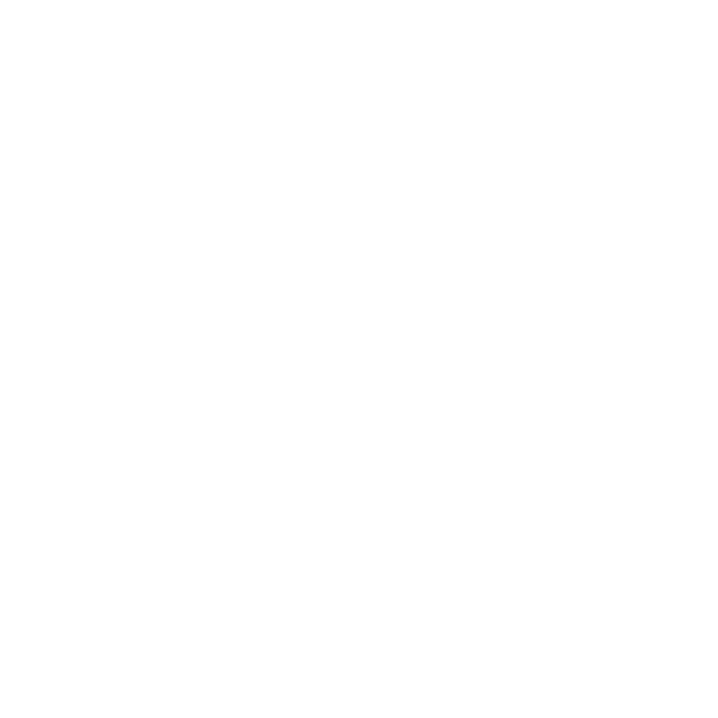

# Hey there, I'm Justin!

**`Developer/Artist/Creator`**

I am a student at Southern Arkansas University, taking a bachelor's degree in Computer Science: Cyber Security and Privacy Option. I have an interest in data science and cybersecurity. I also do digital art projects like illustrations and comic strips on Instagram and Twitter.

### Find me on:

&nbsp;&nbsp;

&nbsp;&nbsp;

&nbsp;&nbsp;

### Languages and Tools:

[][profilelight]
[][profiledark]
[][profilelight]
[][profiledark]
[][profilelight]
[][profiledark]
[][profilelight]
[][profiledark]
[][profilelight]
[][profiledark]
[][profilelight]
[][profiledark]
[][profilelight]
[][profiledark]
[][profilelight]
[][profiledark]
[][profilelight]
[][profiledark]
          
 
 

---

## Course Projects:
### <ins>2-3 Tree Data Structure</ins>

### <ins>Grocery Store Inventory System</ins>

[profile]: https://github.com/aJustinOng
[profilelight]: https://github.com/aJustinOng#gh-light-mode-only
[profiledark]: https://github.com/aJustinOng#gh-dark-mode-only
