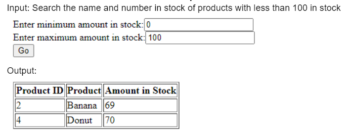

# Hey there, I'm Justin!

**`Developer/Artist/Creator`**

I have an interest in data science and cybersecurity. My first introduction to coding was doing simple JavaScript on Khan Academy when I was ten. Over the years, I took a few online coding and data science courses using languages like Java, Python, and C++. I have done peer tutoring both in high school and in college, tutoring mostly in math and computer science.

I am currently a Senior at Southern Arkansas University, taking a bachelor's degree in Computer Science: Cyber Security and Privacy Option. I have completed [projects](#course-projects) in classes such as **Data Structures & Algorithms** and **Data Modeling & Application**, and in my current semester, I am attending cybersecurity classes such as **Cyber Defense & Privacy** and **Privacy Security & Ethics**. I am also helping my professor with research, with a focus on image processing. I am passionate about getting things done, always learning new skills and polishing old ones.

### Find me on:

&nbsp;&nbsp;

&nbsp;&nbsp;

### Languages and Tools:

[][profilelight]
[][profiledark]
[][profilelight]
[][profiledark]
[][profilelight]
[][profiledark]
[][profilelight]
[][profiledark]
[][profilelight]
[][profiledark]
[][profilelight]
[][profiledark]
[][profilelight]
[][profiledark]
[][profilelight]
[][profiledark]
          
 
 

---

## Course Projects

### KAMI (Kitchen Assistant and Meal Innovator) - AI Recipe Generator

This capstone project's main focus was to make an AI-based recipe generator that functions by feeding it with available ingredients and establishing limits or constraints to the dish. We integrated this into a website that 'invents' new recipes by considering the user's dietary needs and choice of cuisine. The recipe's ingredients, instructions, and AI-generated image are displayed to the user. The project implemented OpenAI's GPT-4 and DALLE-3 APIs into a Django Framework that is connected to a local MySQL database. 

### [2-3 Tree Data Structure][23Tree] 
This was a group project for a Data Structures & Algorithms class in my Sophomore year of university. It is a basic exploration of the 2-3 Trees data structure, a complex version of binary trees. Looking back, we could have structured the code better and added a proper user interface. The output of the current code is limited to the first two levels of the created 2-3 tree.

[][profilelight]
[][profiledark]

Regular binary trees tend to get "unbalanced" after data is inserted or removed. This means that all data are pushed to one side of the binary tree instead of being equally distributed, which increases the time complexity of data retrieval and queries. 2-3 trees do not have this issue because of the way they store data. Nodes that hold data within 2-3 trees can hold up to two values, and they split and merge in a way that maintains a constant balance in the tree. Thus, 2-3 trees are a more effective form of binary trees in databases that constantly update, as the stream of inputs and outputs will not cause an imbalance in the tree.

[profile]: https://github.com/aJustinOng
[profilelight]: https://github.com/aJustinOng#gh-light-mode-only
[profiledark]: https://github.com/aJustinOng#gh-dark-mode-only

[23Tree]: https://github.com/aJustinOng/23Trees
