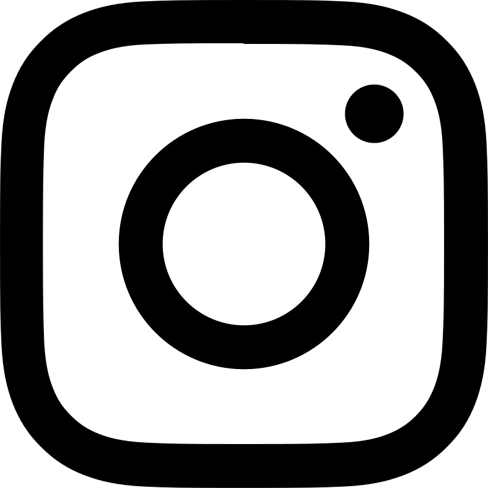
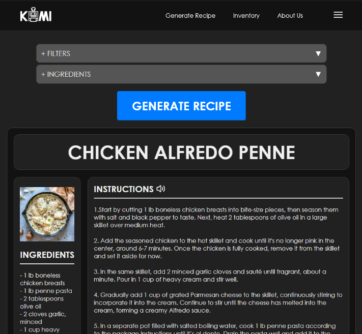
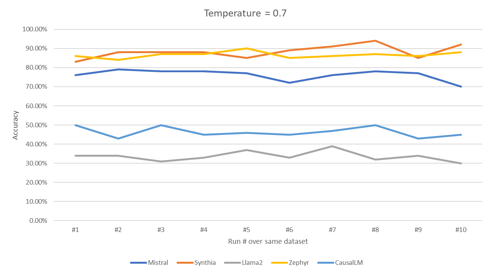
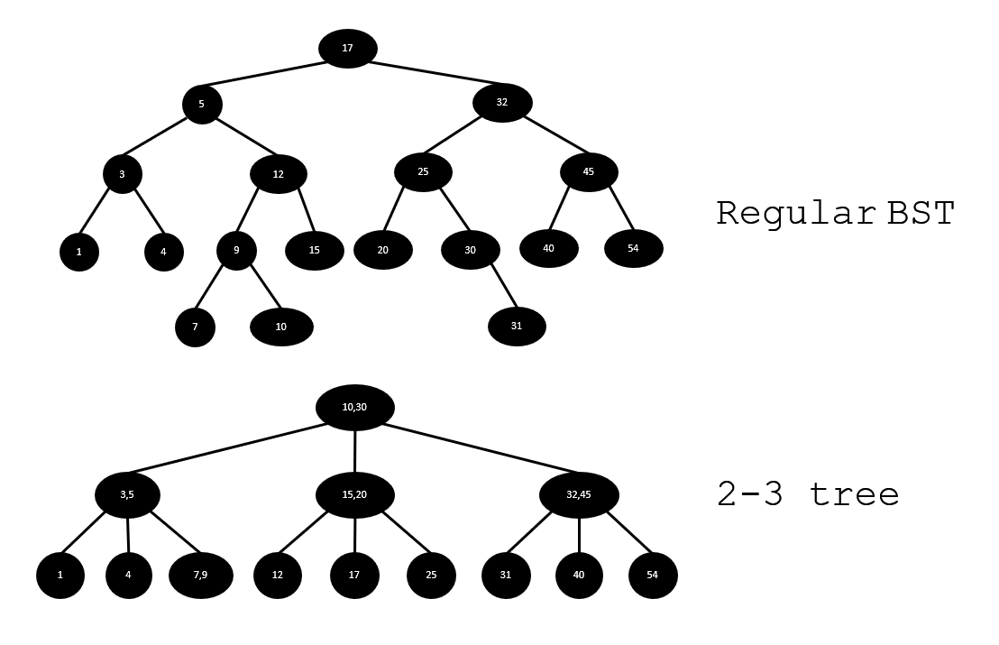
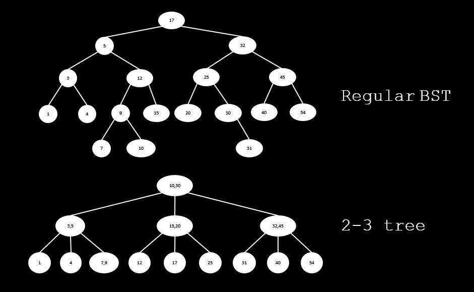

# Hey there, I'm Justin!

**`Developer/Artist/Creator`**

I am an aspiring data analyst with entry-level professional experience in application development. I mainly work with Python, Java, and C++ in various personal and academic projects. I graduated from Southern Arkansas University with a major in Computer Science and a minor in Mathematics. I enjoy collaborating with people and creating ideas!

### Find me on:

&nbsp;&nbsp;

&nbsp;&nbsp;

### Core skills:
Python | Java | SQL | Data Visualization

---

## Projects

### KAMI (Kitchen Assistant and Meal Innovator) - AI Recipe Generator

This capstone project's main focus was to make an AI-based recipe generator that functions by feeding it with available ingredients and establishing limits or constraints to the dish. We integrated this into a website that 'invents' new recipes by considering the user's dietary needs and choice of cuisine.

The recipe's ingredients, instructions, and AI-generated image are displayed to the user. The project utilized OpenAI's GPT-4 and DALLE-3 APIs into a Django Framework that is connected to a local MySQL database.

### LLM SPAM or HAM Classification

As an Honors project for my Cyber Forensics class, I decided to test the ability of different LLMs (Large Language Models) to classify spam emails in a zero-shot environment. Five models—Llama2, Mistral, Synthia, Zephyr, and CausalLM—were given the same dataset of spam and ham emails and instructed to classify them accordingly.

I installed and hosted the models on LM Studio and used the OpenAI API to connect them to a Python .ipynb notebook.

### [2-3 Tree Data Structure][23Tree] 
This was a group project for a Data Structures & Algorithms class in my Sophomore year of university. It is a basic exploration of the 2-3 Trees data structure, a complex version of binary trees. Looking back, we could have structured the code better and added a proper user interface. The output of the current code is limited to the first two levels of the created 2-3 tree.

[][profilelight]
[][profiledark]

Regular binary trees tend to get "unbalanced" after data is inserted or removed. This means that all data are pushed to one side of the binary tree instead of being equally distributed, which increases the time complexity of data retrieval and queries. 2-3 trees do not have this issue because of the way they store data. Nodes that hold data within 2-3 trees can hold up to two values, and they split and merge in a way that maintains a constant balance in the tree. Thus, 2-3 trees are a more effective form of binary trees in databases that constantly update, as the stream of inputs and outputs will not cause an imbalance in the tree.

[profile]: https://github.com/aJustinOng
[profilelight]: https://github.com/aJustinOng#gh-light-mode-only
[profiledark]: https://github.com/aJustinOng#gh-dark-mode-only

[23Tree]: https://github.com/aJustinOng/23Trees
